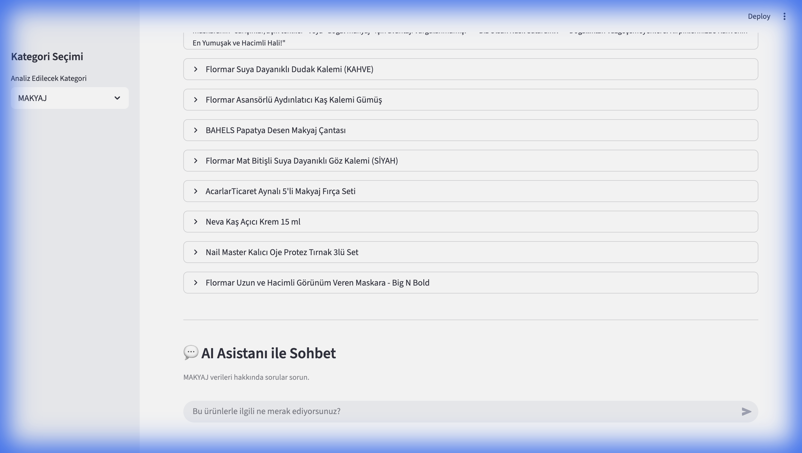

# 📊 Trendyol Kozmetik Pazar Analizi & AI Asistanı

Bu proje, Trendyol üzerindeki kozmetik ürün verilerini (isim, fiyat, yorum sayısı vb.) çekerek analiz eden ve kullanıcıya interaktif bir yapay zeka asistanı sunan gelişmiş bir pazar araştırması aracıdır.



## 🌟 Özellikler

### 1. Veri Çekme (Web Scraper)
*   **Akıllı Algoritma:** Selenium tabanlı bot, "Best Seller" veya "Most Rated" ürünlerini kategorik olarak tarar.
*   **Anti-Blok:** İnsan benzeri davranışlar (scroll, bekleme süreleri) ile engellenmeyi önler.
*   **Detaylı Veri:** Ürün ismi, fiyat, değerlendirme sayısı ve **ürün linkleri** eksiksiz çekilir.

### 2. Yapay Zeka Analizi (Gemini AI)
*   **Otomatik Raporlama:** Seçilen kategorideki ürünleri tek tek inceler.
*   **Stratejik İçgörüler:**
    *   Fiyat Analizi (Pahalı/Ucuz/Rekabetçi)
    *   İsimlendirme Puanı (Clickbait potansiyeli)
    *   Pazarlama Stratejisi Önerileri ("Biz olsak nasıl satardık?")

### 3. İnteraktif Web Arayüzü (Streamlit)
*   **Sekmeli Yapı:** Analiz Raporu ve AI Asistanı için ayrı, temiz sekmeler.
*   **Akıllı Hafıza (Persistence):** Sayfayı yenileseniz bile analiz sonuçlarınız kaybolmaz.
*   **Expander Tasarımı:** Raporlar "Aç/Kapa" kutuları içinde sunularak sayfa karmaşasını önler.
*   **Tıklanabilir Linkler:** Analizdeki ürün başlıklarına tıklayarak doğrudan Trendyol sayfasına gidebilirsiniz.

### 4. AI Chatbot Asistanı
*   **Veriye Hakim:** Çekilen ürün verilerini bağlam (context) olarak kullanır.
*   **Canlı Yazma (Streaming):** Cevapları kelime kelime yazarak doğal bir sohbet deneyimi sunar.
*   **Hazır Sorular:** "En ucuz ürün hangisi?", "Fırsat var mı?" gibi butonlarla hızlı sorgulama.
*   **Link Zorunluluğu:** Chatbot bir üründen bahsettiğinde mutlaka linkini de paylaşır.

## 📸 Demo


## 🚀 Kurulum ve Çalıştırma

### Gereksinimler
*   Python 3.10+
*   Google Gemini API Anahtarı

### Adım 1: Kurulum
Repoyu klonlayın ve gerekli paketleri yükleyin:

```bash
git clone https://github.com/kullanici_adi/trendyol-market-analyzer.git
cd trendyol-market-analyzer
python3 -m venv venv
source venv/bin/activate  # Windows: venv\Scripts\activate
pip install -r requirements.txt
```

### Adım 2: API Anahtarı
`.env` dosyasını oluşturun ve anahtarınızı ekleyin:

```env
GEMINI_API_KEY=AIzaSy...
```

### Adım 3: Çalıştırma
Uygulamayı başlatmak için:

```bash
streamlit run app.py
```

## 🛠 Kullanılan Teknolojiler
*   **Python:** Ana programlama dili.
*   **Streamlit:** Web arayüzü framework'ü.
*   **Selenium:** Web scraping motoru.
*   **Google Gemini (GenAI):** LLM ve analiz motoru.
*   **Pandas:** Veri işleme.

## 📝 Lisans
Bu proje açık kaynaklıdır ve eğitim amaçlı geliştirilmiştir. Ticari kullanım Trendyol kullanım koşullarına tabi olabilir.
